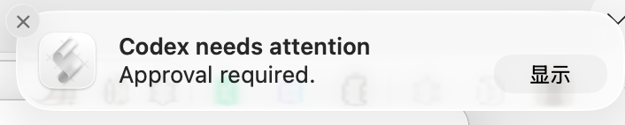
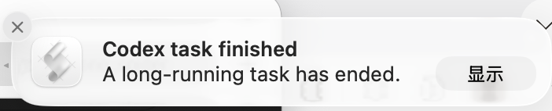

# Codex Sound Alerts

[简体中文](README.zh-CN.md) | [English](README.md)

[](https://github.com/mashukui/codex-sound-alerts) [](https://github.com/openai/codex)  [](https://github.com/mashukui/codex-sound-alerts?tab=MIT-1-ov-file)

Codex Sound Alerts 是一个轻量插件，让你在 Codex 执行长时间任务时无需一直盯着屏幕。它会在以下情况播放不同的提示音，并显示桌面通知：

- Codex 正在等待你审批权限请求。
- 根任务运行满60秒后结束。

插件支持 macOS 和 Windows 10/11。它不会授予权限、自动批准操作、读取屏幕、发起网络请求或启动常驻后台服务。

## 运行要求

- 支持插件 Hook 和 `PermissionRequest` 事件的 Codex CLI 或 Codex App，建议使用 `0.144.3` 或更高版本。
- macOS，或安装了 Windows PowerShell 5.1 及更高版本的 Windows 10/11。

运行插件无需安装 Python、Node.js 或任何第三方依赖。

## 安装

先添加 GitHub marketplace 源，再安装插件：

```sh
codex plugin marketplace add mashukui/codex-sound-alerts
codex plugin add codex-sound-alerts@codex-sound-alerts
```

安装完成后，请重新启动 Codex 会话。Codex 可能会要求你检查并信任插件内置的 Hook。检查命令后确认信任，即可启用提醒。请不要使用 `--dangerously-bypass-hook-trust`。

## 提醒方式

| 事件 | 提示音 | 系统通知 |
| --- | --- | --- |
| 需要审批权限 | Ping / Exclamation | `Codex needs attention` |
| 超过 60 秒的任务完成 | Glass / Asterisk | `Codex task finished` |

### 通知效果

**等待权限审批**



**长任务已完成**



macOS 端使用 `2.0` 增益播放提示音，即 `afplay` 默认增益的两倍。桌面通知通过脚本编辑器（`osascript`）发送。如果没有显示通知，请在“系统设置 > 通知”中为脚本编辑器开启通知权限。

Windows 端使用原生 WinRT Toast 通知。如果 Toast 通知不可用或被禁用，系统提示音仍会播放。Windows 系统提示音不支持单次播放增益，因此会跟随当前系统音量。插件始终遵守操作系统的专注模式、请勿打扰、静音和通知设置。

## 隐私与安全

- 权限审批通知仅使用通用文案，不会显示命令、路径、提示词或工具名称。
- 审批 Hook 不会输出 `allow`、`deny` 或其他决策。Codex 仍会显示正常的权限审批界面。
- 计时状态仅包含 Codex 会话 ID、轮次 ID 的哈希值和 Unix 时间戳。
- 计时文件保存在 Codex 的插件数据目录中，当前轮次结束后会自动删除，超过 7 天的遗留文件也会被清理。
- Hook 出现异常时会以成功状态退出，确保音频或通知问题不会阻塞 Codex。

## 卸载

```sh
codex plugin remove codex-sound-alerts@codex-sound-alerts
codex plugin marketplace remove codex-sound-alerts
```

## 开发与测试

运行无第三方依赖的测试：

```sh
python3 tests/test_plugin.py
```

测试套件会以测试模式运行系统原生提醒脚本：只记录事件，不会真正播放声音或显示通知。

## 开源许可

[MIT](https://github.com/mashukui/codex-sound-alerts?tab=MIT-1-ov-file)
